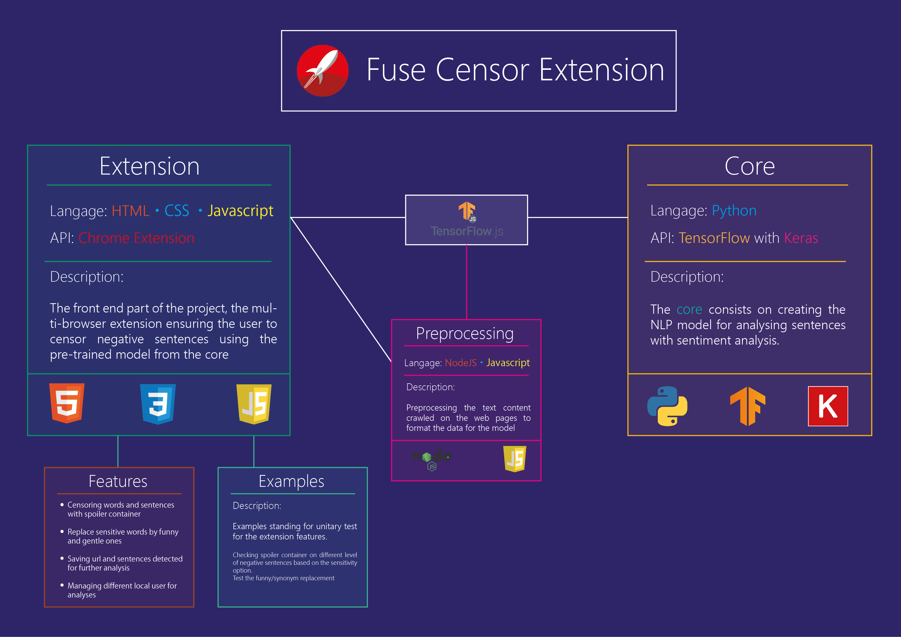
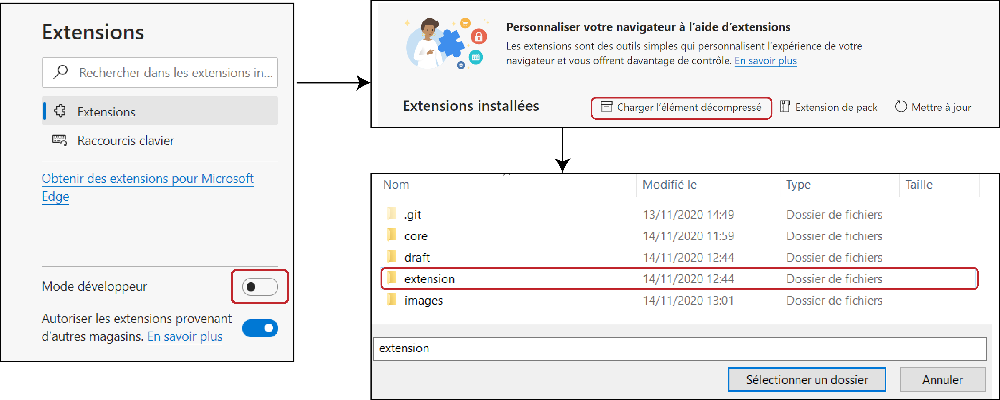
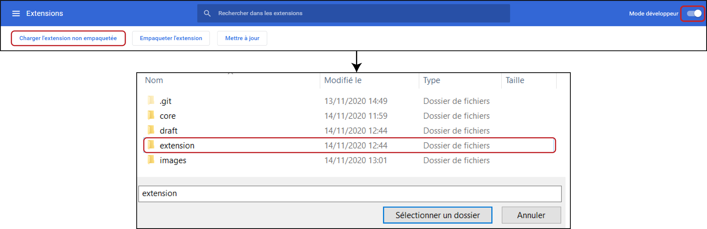
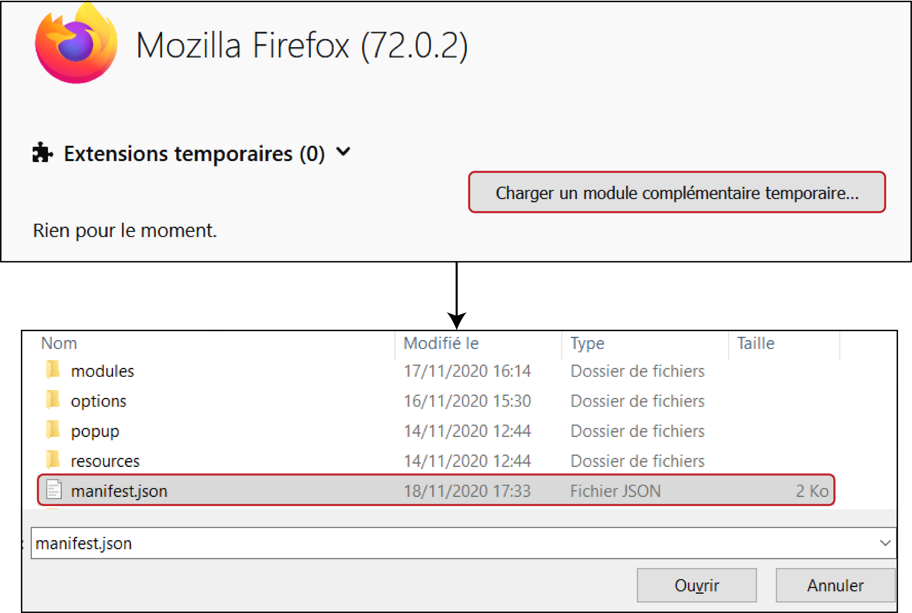

<h1 align="center">Fuse Censor Extension</h1>

<div align="center">
  
</div>

## Introduction

**Fuse Censor** emerged in the context of the Coding Weeks as as project using machine learning and more explicitly Natural Language Processing with Sentiment Analysis. After being through some brainstorming we have come up with the basic idea of a multi-browser extension analysing the body of a page replacing or censoring all explicitly negative contents. 
#
## Description


<!--  -->
<b>Fuse Censor</b> is an extension that provides an efficient way to censor swear words and negative contents based on sentiment analysis through Naturla Langage Processing.
#
## Options


Here you can see how the project has been structured.
<div align="center">
  
</div>

#
## Install

First, you will have to download the gitlab project of the extension. (You will notice that the core folder using Python is not mandatory as it is the core of the AI model trained to analyse sentences, it is saved into the gitlab project for educational reasons to show our work using NLP and for the user to improve the code if he wants to)

```
$ git clone https://gitlab-cw2.centralesupelec.fr/fabien.charlier/swear-analyzer.git
```

In case of future updates and release, simply run this line of command:

```
$ git pull
```

From now on, the installation will be very easy but may differ depending on your browser. 

Here is how it works for Chrome, Mozilla and Edge browser.


<br>
<br>

### Edge browser

First, type in your search bar the following:
> edge://extensions

Then toggle the Developper mode, load the compressed element and select the extension folder:

<div align="center">
  
</div>
Here you go! Have fun!


<br>
<br>

### Chrome browser

Type in the search bar
> chrome://extensions/

Then toggle the Developper mode, load the compressed element and select the extension folder:

<div align="center">
  
</div>
Here you go! Have fun!


<br>
<br>

### Mozilla browser

This one is a bit tricky, type on the search bar
> about:debugging#/runtime/this-firefox
Then click on "Load Temporary Addon..." and open the 'manifest.json' file.
<div align="center">
  
</div>

Here you go! Have fun!